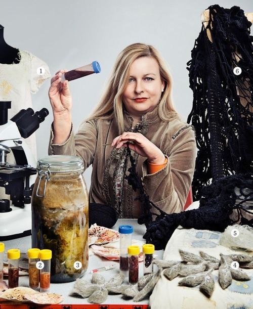
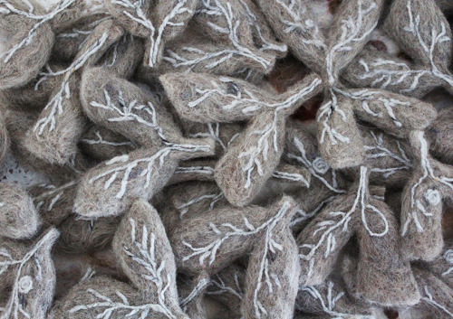

Milí priatelia,

dúfame, že ste v bezpečí a staráte sa o seba a ľudí naokolo. V týchto nezvyčajných a neistých časoch veríme viac ako kedykoľvek predtým v dôležitosť prepojenia a zdieľania. Zostaňme v kontakte aj v časoch sociálnej izolácie, aby sme nielen zhromažďovali naše nápady, ale aj prispeli k tomu, čo nás inšpiruje. Preto sme sa rozhodli sme spustiť týždenný formát, ktorý bude kanálom pre hlasy našej komunity. Budeme spoločne premýšľať o súčasnej pandemickej situácii a jej možných dôsledkoch.

Toto je vydanie č. 1 _Stockpiling Food For Thought s Annou Dumitriu – týždenný karanténny špeciál festivalu Sensorium_.

Na konci minulého roka, keď sme si vybrali tému pre Sensorium 2020, sme vôbec netušili, ako skoro budeme potrebovať túto [NOVÚ SENZIBILITU](https://sensorium.is/new-sensibility). 

Bojíme sa o svoje zdravie, o zdravie svojich blízkych, o našu hospodársku situáciu, o spoločnosť, v ktorej žijeme. No cítime aj to, že prežívame niečo jedinečné, čo je veľkou výzvou, pretože svet už nie je taký, na aký sme boli zvyknutí. Cítime, že musíme zostať pozorní, sústredení a veriť, že sa prispôsobíme. Musíme sa naučiť novým spôsobom, ako zostať v spojení jeden s druhým, ale aj s naším prostredím, presvedčeniami a spôsobmi bytia. Musíme prehodnotiť našu schopnosť zažívať neistotu. Musíme rozvíjať – novú senzibilitu.

Avšak dôležité je, že my veríme vo vás – našu tvorivú komunitu, ktorá často vidí aj za to, čo je očividné. Cieľom týchto rozhovorov je vytvoriť nový rituál ponúkajúci myšlienky, inšpirácie a nápady umelcov, mysliteľov a ľudí, ktorých obdivujeme, aby sme vždy mali dostatok „potravy pre dušu”. Neváhajte nám napísať svoje želania pre ďalšie rozhovory!

***

V prvom vydaní chceme prehodnotiť naše vnímanie choroby a položiť si otázku, či samotná pandémia môže byť inšpirujúca. Hovorili sme s [**Annou Dumitriu**](https://www.annadumitriu.co.uk ), britskou umelkyňou, ktorá sa zaoberá skúmaním vedeckých, kultúrnych a osobných dôsledkov infekčných chorôb. Jej jedinečný kreatívny proces sa odohráva v laboratóriu, ale aj v štúdiu, a zmazáva hranice medzi umením a vedou. Anna vytvára inštalácie, intervencie a predstavenia pomocou rôznych digitálnych, biologických a tradičných médií vrátane živých baktérií, robotiky, interaktívnych médií a textilu. Jej tvorba je vystavovaná vo významných múzeách po celom svete (ZKM, Ars Electronica, BOZAR, Picassovo múzeum, Múzeum V & A, Philadelphia Science Center, MOCA Taipei, LABoral, Art Laboratory Berlin, 6. Guangzhou Triennial, HeK Basel, v londýnskom Furtherfield a v oxfordskom múzeu histórie vied...).

**Sensorium: Ďakujem, Anna, že si venovala svoj čas odpovedaniu na naše otázky! V prvom rade, kde tráviš toto zvláštne obdobie a aká je tvoja skúsenosť so sociálnou izoláciou?**

**Anna Dumitriu:** Píšem z môjho domu na pobreží južného Anglicka v meste Brighton, zatiaľ som fyzicky v poriadku, ale snažím sa spracovať to, čo sa deje, rovnako ako všetci ostatní. Nie som v izolácii, ale praktizujem dodržiavanie fyzického odstupu, keď idem na prechádzku alebo do supermarketu a uisťujem sa, že sa držím ďalej od ostatných, aby som pomohla zastaviť šírenie vírusu. Oficiálne sú zatvorené reštaurácie a bary, je na to veľmi smutný pohľad, ale čo najrýchlejšie zastavenie vírusu je dôležité. Nie som tu sama, som so svojím partnerom a spolupracovníkom, umelcom [**Alexom Mayom**](https://www.alexmayarts.co.uk/), takže mám spoločnosť. Sme zaneprázdnení tvorbou nových diel pre budúce výstavy. Prebiehajúcu prácu budem zdielať aj na svojich sociálnych sieťach.

**Sensorium: Prečo je pre umelca zaujímavé pracovať s témou choroby?**

**Anna Dumitriu:** Osobitne sa zaujímam o infekčné choroby, pretože sú to neviditeľné, vznešené organizmy, ktoré na nás môžu mať obrovský vplyv a dokonca môžu ovplyvniť celú spoločnosť. Vždy hovorím o tom, ako mali infekčné choroby najväčší vplyv na ľudstvo v celej histórii, ale nečakala som, že to uvidím na vlastné oči a takto zažijem. Myslím, že to bolo z mojej strany naivné.

 
**Sensorium: Aký by si si želala, aby bol vplyv tvojej práce a akú reakciu očakávaš od publika?**

**Anna Dumitriou:** Snažím sa svojou prácou rozprávať príbehy a vykresľovať časové linky, zamerať sa na históriu zdravotnej starostlivosti a chorôb, na súčasný výskum a biotechnologické prístupy, ktoré sa používajú na boj proti týmto chorobám, ako je sekvencovanie/radenie celého genómu a syntetická biológia. Som vášnivou bojovníčkou proti rezistencii na antibiotiká, napríklad v mojom prebiehajúcom projekte _**[Romantická choroba](https://annadumitriu.tumblr.com/RomanticDisease)**_ o tuberkulóze, ktorá je najväčším svetovým infekčným zabijakom.

Myslím, že je toho veľa, čo sa môžeme retrospektívne naučiť skúmaním toho, ako sme sa zaoberali infekciami v minulosti, aké chyby sa vyskytli a ako sa vytvorili mýty o príčinách a liečbe chorôb. To všetko sa deje aj dnes ale inak - od obviňovania určitých obetných baránkov po nepravdivé rady o zbytočných liečbach.

 <small><small>_Kde je prach, tam je nebezpečenstvo. Plsťové pľúca infikované DNA Mycobacterium tuberculosis, súčasť projektu "Romantická choroba" Anny Dumitriu_<small><small>

**Sensorium: Akú úlohu môže hrať umenie v pandemických situáciách, aké zažívame teraz?**

**Anna Dumitriu:** Súčasnú pandémiu považujem za pozoruhodnú, pretože sa tak jasne odohráva v sociálnych médiách a je to prvýkrát, čo sa to stalo na tejto úrovni. Od začiatku pandémie som si robila rozsiahlu zbierku príbehov a výskumov, o jej vývoji. Mnoho prvkov z týchto príbehov sa odráža v [denníkoch](https://www.pepysdiary.com/) **Samuela Pepysa** a v **[Denníku morového roku](https://en.wikipedia.org/wiki/A_Journal_of_the_Plague_Year)** Daniela Defoea.

Pozoruhodné je aj to, ako sa teraz umelci podporujú navzájom. Odkedy sa choroba v Spojenom kráľovstve zhoršila, začala som dostávať správy od umelcov a kurátorov z celého sveta (vrátane Číny, Taiwanu, Singapuru, Nemecka a Rakúska), ktoré sa pýtali, či som v poriadku, a písali mi o svojej situácii doma. Je ako tak upokojujúce, že na mnohých miestach sa už z najväčšieho prepuknutia dostávajú. 

Ďalším dôležitým aspektom tejto situácie je umožniť jej inšpirovať moju prácu. Som rada, že môžem prispôsobiť aj jednu súčasnú umeleckú objednávku. Zaoberá sa skúmaním vplyvu izolácie a karantény (v dôsledku pandémie COVID-19) na otázku domáceho zneužívania a násilia z globálneho hľadiska.

**Sensorium: Aká kreatívna reakcia na pandémiu ťa najviac zaujala?**

**Anna Dumitriu:** **Múzeum umenia ZHI ** v Čengdu v Číne pripravuje ako odozvu jednu online výstavu, do ktorej pozvali prispieť aj mňa. **CAFA** (Centrálna akadémia výtvarných umení) v Pekingu už uverejnila [článok](http://www.cafa.com.cn/en/opinions/reviews/details/8327290) o umeleckých dielach zaoberajúcich sa chorobami a liečením, ktorého súčasťou je aj moja práca.

Zhodou okolností moje dielo _**[Morové šaty](https://annadumitriu.tumblr.com/PlagueDress)**_ má byť súčasťou odloženej výstavy _**[Infikovaný](https://rijksmuseumboerhaave.nl/te-zien-te-doen/besmet/)**_. Pôvodne mala byť otvorená v apríli v múzeu **Rijks Boerhaave** (bývalá morová nemocnica). V jeho zbierke sa nachádza aj mikroskop používaný na prvotné objavovanie baktérií. Expozícia bola dlho plánovaná a dôkladne skúmaná. Pre mňa aj zamestnancov múzea je veľmi znepokojujúce vidieť, aká aktuálna je táto téma, o ktorej sme sa snažili prostredníctvom našej práce zvýšiť povedomie.

 <small><small>_"Morové šaty", dielo Anny Dumitriu_<small><small>  

**Sensorium: Niektorí ľudia tvrdia, že táto pandémia urýchli širšie zmeny v nastavení spoločnosti. Súhlasíš? Môžeš opísať svoj pohľad na význam a potenciálny vplyv tejto udalosti vo väčšom rozsahu?**

**Anna Dumitriu:** Myslím, že tu samozrejme bude určitý dosah, ale je naozaj ťažké povedať, čo to bude. Mnohé veci sa vrátia k „normálnemu“, iné zažijú „novú normálnosť“.

Zvyky sa tvoria v priebehu niekoľkých týždňov, takže si myslím, že by si ľudia mohli radšej zvyknúť na online stretnutia ako na také veľké množstvo pracovných ciest. Univerzity budú možno vyučovať viac predmetov online, čo bude mať významný vplyv hlavne na pedagógov. Letecké spoločnosti bojujú s aktuálnou situáciou, ale napriek tomu, že ešte nevieme, čo sa stane, ja dúfam, že prežijú aspoň inovatívnejší dopravcovia. Samozrejme, očakáva sa, že recesie zasiahnu malé podniky a živnostníkov, ale aj veľké podniky. Niektorí sa obávajú uzatvárania hraníc a toho, čo by to mohlo znamenať pre budúcnosť, ale je myslím nepravdepodobné, že zostanú zatvorené dlhšie, ako je nutné.

Pozitívne je, že v oblasti zdravotnej starostlivosti dôjde k veľkým inováciám. Vírus SARS-CoV-2 bol sekvenovaný v celom genóme a ľudské štúdie s novou vakcínou sa začali o menej ako 70 dní, čo je neuveriteľné. Ďalším krokom je nájsť test protilátok, aby sme videli, kto bol infikovaný a mohol by byť imunitný (ako naznačujú štúdie na opiciach Rhesus).

Z umeleckého hľadiska je to ťažké povedať. Mnoho umelcov bolo veľmi zasiahnutých, vrátane mňa. Zrušilo a odložilo sa mi veľa udalostí a výstav. Zároveň je tu aj veľká podpora a zdá sa, že dokonca dôjde k presmerovaniu niektorých finančných prostriedkov na podporu nezávislých umelcov. Chápem, že svetu komerčného umenia sa darí dobre, ako sa často stáva, keď je akciový trh neistý. Všetko ešte len uvidíme a ja myslím na všetkých, ktorých táto situácia nejakým spôsobom zasiahla.

 <small><small>_Archaeabot,  dielo Anny Dumitriu a Alexa Maya - fotografia: Vanessa Graf - Ars Electronica
_<small><small>      

***

Anna Dumitriu online:
    
    
[Web](https://www.annadumitriu.co.uk)

[Instagram](https://www.instagram.com/annadumitriuart/)

[Facebook](https://www.facebook.com/annadumitriuarts/ )

[Twitter](https://twitter.com/AnnaDumitriu)
***

Kredity:

Text: Célia Bugniot

Editorka: Lucia Dubačová

Vydáva: Sensorium Festival

Fotografie: archív Anny Dumitriu 
