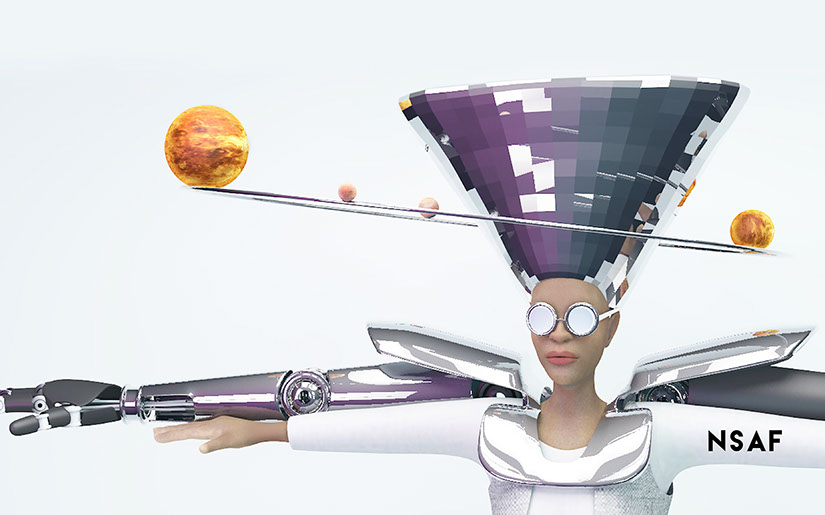
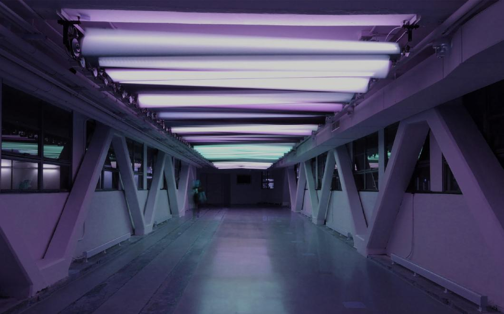
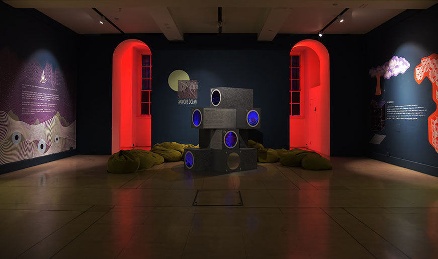

This is edition #6 of Stockpiling Food For Thought - the Sensorium Quarantine Weekly Special, with Hyphen Labs.         

After nearly two months of quarantine, we may feel our life is evolving towards a strange “new normal”. But what happens after that? Do we keep these new habits, do we go back to acting the way we did before, or do we evolve to create a new reality? We spoke to multidisciplinary collective **Hyphen Labs** about what the current period can teach us about ourselves and about our society.

    
***

**Hyphen Labs** is an award-winning international collective of women with a base in London, UK. Their projects oscillate between technology, design, art, science and futurism to challenge conventions and stimulate conversations. Drawing from their diverse perspectives and expertises - ranging from engineering and molecular biology to game design and architecture, they cultivate a resolutely global and multidisciplinary approach to explore a future built on planetary-centered design, placing collective needs and experiences at the centre of perpetually evolving narratives. 

<small>NeuroSpeculative AfroFeminism, cross-platform project by Hyphen Labs, at the intersection of product design, virtual reality, and neuroscience.</small>

**Sensorium : Tell us about your current situation. From where are you writing, how did you adapt to the circumstances?**

**Hyphen Labs :** We are all currently staying home and based in London. This week marks around 6 weeks of constant isolation from each other and the public. Around March 11, we decided to stop working from our studio after more and more cases were popping up in Europe. Before the pandemic started, we were working on a few commissioned projects, digital experiences as well as physical installations coming up in galleries and at festivals.  We were looking forward to a summer full of workshops and speaking events and developing new work. As things got more serious, like for everyone else, the jobs that required any physical presence were postponed and cancelled. So, we are currently working on developing existing and new digital projects.  

We also try to fill our days experimenting and learning. We are investing time into doing the things that keep us curious,  inspired and feel rewarding, including: exercise (bikes & home yoga + digital classes), reading, cooking, Zoom calls, Whatsapp message groups, live streaming concerts, facetime with friends and family, drawing, writing, growing food and flowers, listening and meditating. 

Maintaining routine, communication and practicing sensitivity and compassion will hopefully get us through this pandemic.  We also want to acknowledge and appreciate all essential workers, single parents, our elders and a huge thanks to the hospital workers keeping us and our loved ones alive. 

<small>Prismatic_NYC, luminous-kinetic sculpture by Hyphen Labs above The High Line in New York City</small>

**Sensorium : Has the current situation been in some way stimulating to your creative process? Have you been thinking of new projects or new ways of presenting your projects ? **

**Hyphen Labs :** Interesting question. We started working together in 2014, our backgrounds are in architecture and engineering and we were exploring parametric and computational design.  We met during a masters program and are from completely different places, and it was our differences which encouraged us to think through how we could communicate universally through digital and physical experiences and spaces. We started our studio working together across time zones, so we are used to remote work. And when we finally had a studio and were located in the same place, we recognized the value of physical presence, actually having to get dressed and go to work, giving each other a hug, laughing together, grabbing a drink after work and having the spaces and times for random thoughts. Now as we are adjusting to the changes we still have virtual studio brunches and pub clubs, where we try not to talk about work. We must be flexible to figure new ways of working and existing out and it's an exciting challenge to try to figure it out and continue to produce.

But some days, let's be honest...it's hard to concentrate - to stay motivated and focus.  The virus has really exposed the existing disparities within our societies. Our hearts and minds are thinking of those who are trying to survive, who have been laid off and subsequently lost their income and health insurance, are immunocompromised, can’t pay rent, are undocumented, isolated at home, alone - losing their lives and their family members because collectively, we (+ some of our governments) didn’t take the pandemic seriously enough and live in a broken system that benefits few and discards the rest.  Are we not all beings?

<small>[The Gospel According to Yawn](https://vimeo.com/369876347), interactive booth commissioned by Somerset House to respond to the book [24/7: Late Capitalism and the Ends of Sleep](https://www.theguardian.com/books/2014/jul/22/24-7-late-capitalism-ends-sleep-jonathan-crary-review) by Jonathan Crary.</small>

**Sensorium : You work "at the intersection of technology, art, science and the future". How do you interpret the central role of technology in the current crisis? **

**Hyphen Labs :** As to any “central role” of anything in a crisis, there are potentials and pitfalls. Technology has in ways has activated us to communicate more effectively and as society moves online we see the nuance in which everyone is adapting. We are inspired by all of the mutual aid groups that have popped up, the sharing of sewing patterns, tutorials and DIY videos, and oh...the memes! 

But there are many pitfalls. More than ever, we are tethered to our screens as a form of escapism and for (mis)information. Is it possible to absorb so much media and are we actually retaining it? When it comes to policy, Covid-19 is a great excuse for implementing the surveillance state which deepens the ‘big data biopolitics’ that depends on sketchy algorithms to track us and alert authorities and as we know the outcomes of this will not be the same for all of us, but will reinforce stereotypes and endanger lives. We will inherit another toxic system that will  be difficult to dismantle.

<small>[Higher Resolution](https://www.tate.org.uk/whats-on/tate-modern/tate-exchange/workshop/higher-resolution), an exhibition and workshop curated and produced by Hyphen Labs at Tate Exchange (2019), questioning our relationships with digital platforms, the power behind technology, and how art can be used as a tool of intervention.</small>

**Sensorium : Some people say this pandemic will accelerate a wider paradigm shift in society. Do you agree? Can you describe how you see the importance and impact of this event on a larger scale?**

**Hyphen Labs :** There have been lots of discussions about this, across industries, think tanks, Zoom chats and Whatsapp groups, we all seem to be buzzing around the question: Do we want to go back to ‘normal’?   

We do not. 

Can we extract the bits of ‘normal’ that worked, while building an alternative future?  What are the things we want to see in the future? Who is doing that work? How can we share work and efforts and put those ideas into practice? Where and how does this start? 

Our discussions have led to valuable insights around recalling valuable practices and analysing our relationships. Without falling into the potholes of self preservation, how do we relate and give to ourselves (small/personal), our community (local), and our planet (globally). Each level of giving (personal/local/global) requires different kinds of work and with an emphasis of self reflection allows for the development of the individual. Moving forward, if we can govern our own personal ecosystems effectively, and even encourage a bit of our own rewilding, in a human or botanical sense, we will form a sense of ourselves and resilience. 

To be more specific, the smaller or personal work we are collectively thinking about includes variations on the idea of practices. From walking to meditating, our ability to reflect on the ‘self,’ gives us a chance to reassess what actually sustains us and keeps our minds and bodies in alignment and balance. This can be done by oneself and with the help of healers or practitioners, through peer therapy or by giving back to a community.  

It is vital to collectively attempt to understand the systems in which we exist and move away from capitalistic focused mindsets.  Western cultures are so focused on acquiring, saving and hoarding ‘stuff.’  Material belongings don’t help us belong and aren't essential for our existence. When we share instead of stockpile, it helps us shift our consciousness to one of awareness and interconnectivity. 

Now, we are aware that we aren’t exactly saying anything new... but somewhere with the introduction of a ‘normal’ way we got really busy and maybe a bit distracted.  
In terms of identifying more immediate shifts, it has been inspirational to see the countries battling the pandemic with the highest success rates have all been led by women!!! It is also inspirational to see how broken and poor leadership leads to smaller and more local governance. 
 
A couple of books we would like to recommend are:

* [Severance](https://www.newyorker.com/books/under-review/ling-ma-severance-captures-the-bleak-fatalistic-mood-of-2018), by Ling Ma
* [The Mushroom at the End of the World](https://www.theguardian.com/books/2017/oct/19/mushroom-end-world-anna-lowenhaupt-tsing-review), by Anna Tsing
* [Parable of the Sower](https://www.newyorker.com/books/second-read/octavia-butlers-prescient-vision-of-a-zealot-elected-to-make-america-great-again), by Octavia E. Butler 

<small>The Anxious Ocean &amp; the Moonbathers, speculative interactive installation by Hyphen Labs exploring a post-human underwater future</small>

**Sensorium : What has been the most inspiring or creative reaction to the pandemic that you have seen so far?**

**Hyphen Labs :** What a great question!  One of the coolest things is seeing the creativity pouring out from social media, from tutorials to concerts to reading groups and dance classes. It's really interesting to see how society has dealt with the shift to being home and online. More abstractly, it's interesting to experience time in a new way, especially how it bends and drifts, as witnessed through the growing plants inside and out and the sun running across our apartment walls. Spring is bursting and our nails and hair seem to be taking up all the energy produced by our latent bodies, resulting in a collective shaggy look. Personally, we are experiencing both the slow and fast paces of our natural world, through new things like sourdough and running. Our favorite creative reaction so far was [this recreation of Avatar: the Last Airbender opening sequence featuring Covid 19 and Cardi-B](https://twitter.com/i/status/1241766179401797637). 

**Thanks a lot to Hyphen Labs for the amazing ideas and references!**

***

Links:

[hyphen-labs.com](http://www.hyphen-labs.com/)  
[Hyphen Labs Instagram](https://www.instagram.com/hyphenlabs/)  
[Hyphen Labs facebook](https://www.facebook.com/hyphenlabsinternational/)  

***

Credits:  
Writing: Célia Bugniot  
Interviewees: Ece Tankal, Carmen Aguilar y Wedge, Romy Gad el Rab -  Hyphen Labs  
Editing: Lucia Dubačová  
Publishing: Sensorium Festival  
Pictures: Courtesy of Hyphen Labs  

[Previous editions - Stockpiling Food For Thought](https://sensorium.is/#food_for_thought)
