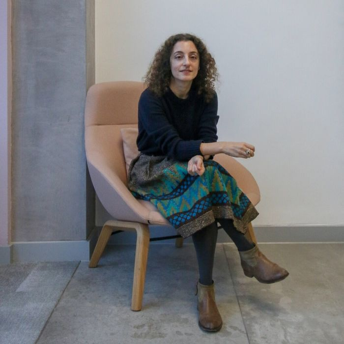
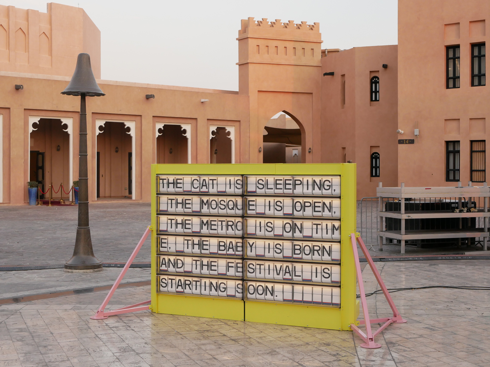
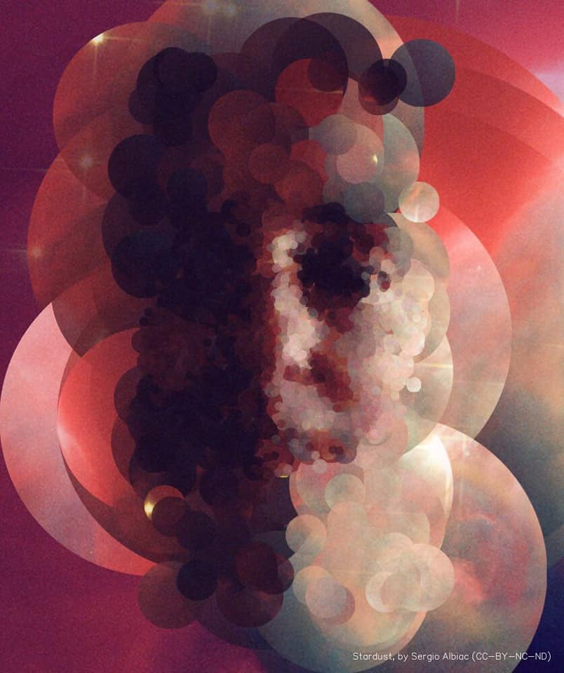

Milí priatelia,

dúfame, že ste v bezpečí a staráte sa o seba a ľudí naokolo. V týchto nezvyčajných a neistých časoch veríme viac ako kedykoľvek predtým v dôležitosť prepojenia a zdieľania. Zostaňme v kontakte aj v časoch sociálnej izolácie, aby sme nielen zhromažďovali naše nápady, ale aj prispeli k tomu, čo nás inšpiruje. Preto sme sa rozhodli sme spustiť týždenný formát, ktorý bude kanálom pre hlasy našej komunity. Budeme spoločne premýšľať o súčasnej pandemickej situácii a jej možných dôsledkoch.

Toto je vydanie č. 2** _Stockpiling Food For Thought s Irini Papadimitriu_** – týždenný karanténny špeciál festivalu Sensorium.

Kurátori sú dôležitými **aktérmi pre sprostredkovanie, kontextualizáciu, obohacovanie a šírenie** úžasných pohľadov na realitu, ktoré denne ponúka umenie a kultúra. Rozprávali sme sa s fantastickou [Irini Papadimitriou](https://futureeverything.org/people/irini-papadimitriou/), ktorá s naším tímom pravidelne a ochotne spolupracuje na mnohých projektoch minulých aj budúcich. Irini je svetová kultúrna manažérka, kurátorka a **kreatívna riaditeľka manchesterskej organizácie Future Everything**. Hovorí o tom, ako riešia situáciu v ich organizácii, ale aj o prepojeniach medzi pandémiou a umelcami, s ktorými spolupracovala.

Interdisciplinárny a kritický diskurz je východiskom pre prácu Irini Papadimitriou, ktorá skúma **vplyv technológií na spoločnosť a kultúru**. Zaujíma ju aj to, ako nám môže umenie pomôcť zapájať sa do procesov riešenia súčasných problémov. Medzi jej kurátorské výskumné oblasti patrí technológia a etika, surveillance society(spoločnosti vykonávajúce dohľad), digitálne občianstvo a verejná (fyzicko-digitálna) sféra.

Aktuálne pôsobí ako kreatívna riaditeľka [FutureEverything](http://www.futureeverything.org/), manchesterského inovačného laboratória a umeleckej organizácie. Predtým pracovala ako **manažérka digitálnych programov v londýnskom Viktória a Albert múzeu** (V&A), iniciovala a bola hlavnou kurátorkou festivalov Digital Design Weekend, Digital Futures a ďalších programov. Pôsobila ako **vedúca programu Vývoja novomediálneho umenia a kurátorka výstavných programov** v múzeu Watermans.

Je spoluzakladateľkou Art & Culture programu na [Mozilla festivale](https://www.mozillafestival.org/en/) a kritickej skupiny [Maker Assembly](https://makerassembly.org/) venujúcej sa kultúre „makers”. Irini patrí medzi členky [inštitútu IWM](https://www.iwm.org.uk/) a realizuje kurátorské výskumné programy vrátane MOBIUS (Fínsky inštitút), Mondriaan Fonds a British Council. Je členkou poroty [Ars Electronica](https://ars.electronica.art/festival/en/), [Lumen Prize](https://lumenprize.com/), [EU STARTS](https://www.starts.eu/) a [ACM Siggraph](https://www.siggraph.org/).

Jej výstava, [_Artificially Intelligent_](https://www.vam.ac.uk/blog/digital/artificially-intelligent-digital-design-weekend-2018), bola vystavená vo V&A v roku 2018.

 <small><small>_Práve teraz_ (_At The Moment_), Katriona Beales, expozícia Artificially Intelligent, V&A 2018<small><small>

    
**Sensorium: Odkiaľ píšeš, v akej si situácií?**
    
    
**Irini Papadimitriou:** Píšem zo svojho domu v Manchestri, v súlade s naším rozhodnutím vo FutureEverything začiatkom tohto týždňa (preventívne opatrenia) – (poznámka editora: odpovede sú datované 21. 03. 2020) – začať pracovať z domu. Viem, že veľa ľudí nemá túto možnosť, takže sme vďační, že sme v privilegovanej pozícii, ktorá nám domácu kanceláriu umožňuje. Minule musel som musela navštíviť kanceláriu, ktorú zdieľame s inými organizáciami, a bolo tam desivé, znervózňujúce ticho.
    
    
Keďže náš tím momentálne nemôže byť na rovnakom priestore, organizujeme denné porady vo forme „Raňajkového klubu“ :), čo je skvelý spôsob, ako začať náš deň a uistiť sa, že sa môžeme v tomto zložitom období skontaktovať a vzájomne podporiť. Tento ranný „check-in” s tímom nám tiež pomáha, aby sme zostali sústredení a plánovali dopredu (aspoň nakoľko je to možné). Nedávno sme na našej webovej stránke zverejnili [vyjadrenie](https://futureeverything.org/news/covid-19-update-a-note-to-our-collaborators/), v ktorom sa zdôverujeme spolupracovníkom a komunite s reakciou na pandémiu. Snažíme sa využívať najmä naše webové stránky a blog na uverejňovanie článkov, ale hľadáme aj spôsoby, ako podporiť našich umelcov online a zostať v kontakte s naším publikom.
    
    
Sme v plnom pracovnom režime a v súčasnosti pripravujeme niekoľko projektov, ako sú napríklad „Unintended Intentions”, dlhodobý projekt s National Trust v [Quarry Bank](https://www.nationaltrust.org.uk/quarry-bank). Projekt je realizovaný v spolupráci s [Invisible Flock](https://invisibleflock.com/) a vedcami z odboru Manchesterskej univerzity – Program životného prostredia, vzdelávania a rozvoja. Projekt bude skúmať vplyv priemyselnej revolúcie na životné prostredie a súčasné výzvy, ale aj alternatívne príbehy o budúcnosti. Čoskoro budeme na našej webovej stránke oznamovať podrobnosti o budúcich plánoch, takže nezabudnite sledovať!
    
    
 
 <small><small>Umelecká objednávka organizácie FutureEverything: premiéra diela _Všetko všade_ (_Every Thing Every Time_) umelkyne Naho Matsuda počas British festivalu Katare v novembri 2019.<small><small>
    

**Sensorium: Prečo by mohlo byť pre umelca / kurátora zaujímavé pracovať s témou choroby? Aký je požadovaný dopad týchto diel, akú reakciu očakávajú umelci a kurátori od publika?**
    
    
**Irini Papadimitriou: **Hoci všetci z nás trpia chorobami, baktériami a vírusmi, držiteľmi hlbších znalostí a porozumenia o nich sú hlavne vedci. Myslím si, že umelci, ktorí pracujú s vedou, v tomto prípade v oblasti chorôb, baktérií alebo vírusov, môžu poskytnúť nové perspektívy, ale tiež spochybniť aktuálne vnímanie týchto javov.
    
    
Umelci zaoberajúci sa týmito témami pomáhajú odhaliť mikroskopický, holému oku neviditeľný svet, ktorý je pre väčšinu ľudí zvyčajne neprístupný a strašidelný. Očividné javy, aké je dôležité spomenúť alebo vidieť v chorobách, baktériách a vírusoch, sú tou hroznou a negatívnou stránkou, ale prostredníctvom umenia dokážeme pochopiť mikroorganizmy, ako sú baktérie a vírusy, na úrovni ďalších žijúcich bytostí, ktoré sa snažia o prežitie.
    
    
Spoluprácou s umelkyňou [Annou Dumitriu](https://annadumitriu.tumblr.com/), ktorej dielo považujem za fascinujúce, som zistila, že baktérie používajú na vzájomnú komunikáciu chemické signály čo ich robí živou sieťou mikroorganizmov.
    
Keď som zas pracovala s [Giuliou Tomasello](https://gitomasello.com/), dozvedela som sa viac o „dobrých“ baktériách a o tom, aké sú dôležité pre naše telo a zdravie.
    
    
Aby sme sa však vrátili k téme ochorení, umelci, ktorí sa s ňou zaoberajú, môžu odhaliť nielen medicínske procesy, ale aj etické otázky a otázky politiky, finančného zisku či nerovnosti. V čase krízy, akou je súčasná pandémia, je zrejmé, aký nespravodlivý je na niektorých miestach zdravotný systém a koľko ľudí k nemu nemá prístup.
    
    
Umelci môžu spochybniť aj vnímanie choroby. Jedným z projektov Anny Dumitriu, ktorého som v roku 2014 bola kurátorkou v rámci programu múzea Watermans v Londýne, bola [_„Romantická choroba: umelecké skúmanie tuberkulózy”_](https://www.watermans.org.uk/new-media-arts-archive/the-romantic-disease-an-artistic-investigation-of-tuberculosis/) (_The Romantic Disease: An Artistic Investigation of Tuberculosis_). Brilantný dlhodobý výskum a investigatíva historických príbehov okolo tuberkulózy s cieľom preskúmať a zdieľať mylné predstavy, mýty a povery okolo tejto choroby. „Romantická choroba” bola jedným z najzaujímavejších projektov, na ktorých som sa podieľala a zapájala divákov do diania úžasným spôsobom prostredníctvom výstavy, workshopov a prednášok.
    

 <small><small>_Flóra budúcnosti_ (_Future Flora_), dielo Giulie Tomasello, je zberná súprava určená pre ženy na liečenie a prevenciu vaginálnych infekcií. V roku 2018 Giulia získala ocenenie Grand Prize – Artistic Exploration: udelené za umelecký výskum a diela, pri ktorých má umenie silný potenciál ovplyvniť alebo zmeniť použitie, nasadenie alebo vnímanie technológií.<small><small>
    

**Sensorium: Akú úlohu môže zaujať umenie v pandemických situáciách, aké zažívame teraz?**
    
    
**Irini Papadimitriou: **Ako sme videli v posledných týždňoch, umenie – napriek výzvam – nám môže ponúknuť útechu tým, že vytvára spôsoby, aby sme mohli fungovať a zároveň nás drží pohromade. Umelecké organizácie, umelci a kultúrni profesionáli sú vážne zasiahnutí, keďže väčšina podujatí bola zrušená alebo odložená. Prišli o veľmi potrebný príjem, a zároveň sú v neistej situácii, spoliehajúc sa na prácu na voľnej nohe. Je možné, že postihnuté umelecké organizácie od festivalov po malé múzeá, kultúrne centrá a podobne po pandémii nebudú môcť znova otvoriť.
    
    
Napriek tomuto všetkému umelecká komunita vynaložila obrovské úsilie, aby priniesla divákom umenie, dizajn, hudbu, divadlo, film, písanie, kritické diskusie, vzdelanie, tvorbu a omnoho viac tým, že využíva online platformy a nástroje. Ide o mimoriadne úsilie, ktoré nás udržuje v spojení, inšpirácii a pozitívnom naladení. Zároveň umelecké organizácie, jednotlivci a kolektívy vynaložili úsilie na zdieľanie zdrojov a podporu komunity.
    
    

**Sensorium: Aká bola najzaujímavejšia kreatívna reakcia na pandémiu, ktorú si doposiaľ videla?**
    
    
**Irini Papadimitriou:** Ľudia robia úžasné veci, aby zostali v spojení. Uvažujúc o umeleckej komunite, je úžasné vidieť, ako organizácie (veľké alebo malé), umelci, dizajnéri, kreatívni technológovia a ďalší odborníci hľadajú alternatívne spôsoby a platformy na zdieľanie mechanizmov práce, zdrojov, znalostí a zvládania problémov, ale aj na vzájomné rozhovory spoločné udalosti, aktivity a oveľa viac.
    
    
Cez víkend som sledovala [IAM víkend](https://www.iam-internet.com/weekend) a milujem intimitu online prednášok a diskusií. Pôsobí to omnoho viac ako komunita tým, že je každý u seba doma. Narazila som aj na projekt, kde umelci založili platformu, prostredníctvom ktorej predávajú diela za malú sumu online a keď dosiahnu určitý objem predaja, musia si zakúpiť aj jedno z diela z platformy, aby podporili ostatných umelcov. Je to výborná iniciatíva.
    
Väčšina týchto podujatí a aktivít je pochopiteľne online, vďaka čomu sú prístupné mnohým z nás, ale nie každému. Nemali by sme zabúdať, že stále existuje veľa ľudí, ktorí prístup k internetu nemajú.
    
    
Tiež je skvelé vidieť, ako sa ľudia snažia spojiť so susedmi, počas izolácie vo svojich domovoch, spievaním alebo vzájomnou pomocou pri nakupovaní a podobne. Ľudia používajú aj rôzne dostupné nástroje, aby zostali v kontakte – nedávno som videla narodeniny na Zoome :) a som si istý, že existuje mnoho ďalších prekvapujúcich príkladov.
    
    

 <small><small>_Hviezdny prach_ (_Stardust_): portrét Irini Papadimitriou (s dovolením autora Sergia Albiaca) z posledného dňa víkendu IAM, plného online rozhovorov a workshopov. #weareallmadeofstardust<small><small>
    

**Sensorium: Niektorí ľudia tvrdia, že táto pandémia urýchli širšie zmeny v nastavení spoločnosti. Súhlasíš? Môžeš opísať svoj pohľad na význam a potenciálny vplyv tejto udalosti vo väčšom rozsahu?**

**Irini Papadimitriou:** V posledných rokoch sme boli svedkami jednej krízy za druhou. Len niektoré z posledných udalostí – napríklad požiare v Kalifornii, silné povodne po celom svete, rozsiahle požiare v Austrálii, časté javy extrémneho počasia a teraz pandémia. Práve počas kritických udalostí, ako sú tieto, si pri reakcii vlád, politikov, firiem, korporácií atď. uvedomujeme, ako sme sa mýlili v realizácii vecí doteraz. Opakujeme tie isté chyby, ale ukazuje sa aj sebectvo, nespravodlivosť a obrovské nerovnosti v našej spoločnosti.
    
    
Počas pandémie koronavirusu bolo skutočne upokojujúce vidieť toľko láskavých skutkov, ale na druhej strane je znepokojujúce, že taký obrovský počet ľudí na svete žije v extrémne neistých situáciách bez prístupu k zdravotnej starostlivosti, prístrešia a stabilného príjmu. Je to aj pripomienkou toho, aký krehký je náš svet.
    
    
Počula a videla som reakcie niektorých ľudí, ktorí hovoria, že to tiež prejde, a vrátime sa k normálu. Nie som si však istá, čo vnímame ako normálne. Nechcem byť pesimistická, ale cítim, že pokiaľ radikálne nezmeníme, ako myslíme a konáme, dostaneme sa z tejto krízy a vstúpime do inej. Preto veľmi dúfam, že táto pandémia prinajmenšom poslúži ako ponaučenie na zmenu postojov a dúfajme, že odvráti nasledujúcu krízu.
    
    
_**Ďakujem veľmi pekne Irini za zdieľanie tvojich myšlienok a za to, že si predstavila komunite Sensorium fragmenty tvojej reality.**_

***
Irini Papadimitriou a FutureEverything online:
    
    
[Web FutureEverything](https://www.futureeverything.org/)
    
[Instagram Irini Papadimitriou](https://www.instagram.com/irini_mirena/)
    
[Instagram FutureEverything](https://www.instagram.com/futureverything)

[Facebook Irini Papadimitriou](https://www.facebook.com/irinimirena.papadimitriou)
    
[Facebook FutureEverything](https://www.facebook.com/FutureEverything)
    
[Twitter Irini Papadimitriou](https://twitter.com/irini_mirena)

[Twitter FutureEverything](https://twitter.com/FuturEverything)
    
***

Kredity:

Text: Lucia Dubačová

Editorka: Célia Bugniot

Vydáva: Sensorium Festival

Fotografie: archív Irini papadimitriou, _Future Flora_ - archív Giulie Tomasello 
    
***    
    
Predošlé články:
    
[Stockpiling Food For Thought s Annou Dumitriou](https://sensorium.is/sk/articles/sfft-anna-dumitriu)    
    
