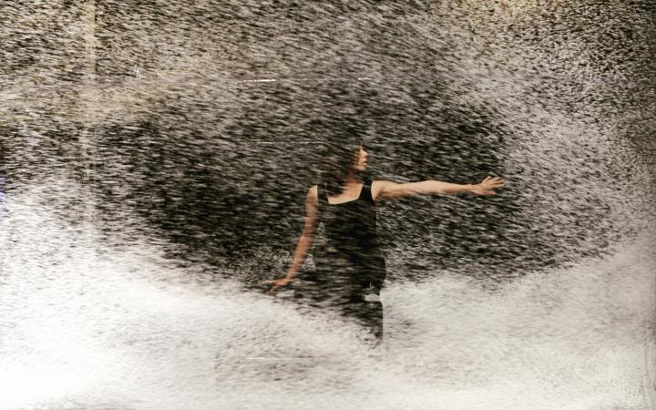
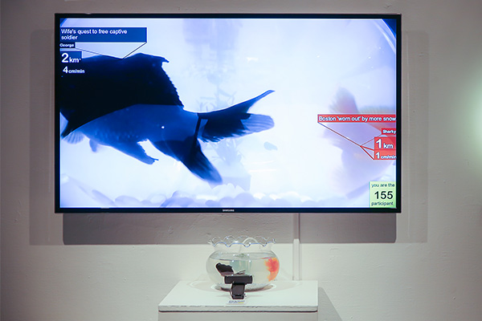
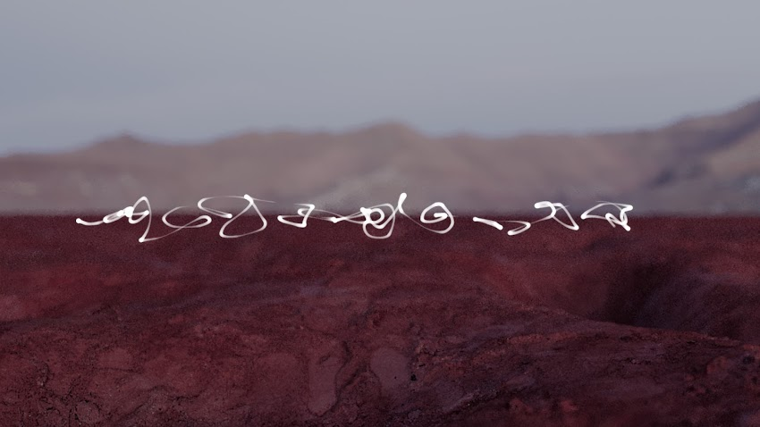

Prinášame vám 8. diel série Stockpiling Food For Thought, týždenného karanténneho špeciálu festivalu Sensorium, tentokrát s **Iris Longovou**

***

Vyzerá to tak, že obmedzenie pohybu v Európe sa pomaly uvoľňuje a nás zaujíma, čo sa bude diať ďalej, najmä vo svete umenia a kultúry. Inšpiráciu sme hľadali v rozhovore s čínskou kurátorkou a výskumníčkou Iris Longovou. Rozprávali sme sa o tom, ako sa umelecký svet v Číne prispôsobil karanténnym opatreniam a o potenciálnej úlohe digitálneho umenia v súčasnej kríze.

 
**Iris Xinru Long** je nezávislá kurátorka, autorka a umelkyňa. Jej výskum sa zameriava na to, ako umenie reaguje na súčasnú svetovú realitu všadeprítomné výpočtové systémy a hromadné údaje. V súčasnosti pracuje ako výskumníčka umenia, vedy a technológie v [Centrálnej akadémii výtvarných umení](http://www.cafa.edu.cn/en/) (Peking, Čína), kde prednáša o dátovom umení a umelej inteligencii a spoluorganizuje konferenciu [EAST – Medzinárodnú konferenciu o vzdelávaní, umení, vede a technológii](http://east.work/).

Iris bola nominovaná na cenu M21-IAAC (Medzinárodná cena za umeleckú kritiku). Za preklad knihy [Rethinking Curating: Art after New Media](https://mitpress.mit.edu/books/rethinking-curating) (Prehodnotiť kurátorstvo: umenie po nových médiách) získala v roku 2016 nomináciu na cenu AAC Art China. V roku 2018 získala cenu Hyundai Blue Prize, kurátorské ocenenie na podporu nových kurátorov. Koordinovala úvodnú prehliadku Art Center OSN „[The Kind Stranger](http://www.unart.org.cn/en/category/exhibition-list/detail!opening-show)“ (2019) a bola súčasťou umeleckej poroty na ISEA 2019 (Medzinárodné sympózium o elektronickom umení) v Kórei.

Jej umelecké diela boli vystavené medzinárodne na rôznych miestach, ako napríklad Múzeum umenia CAFA (Peking), Centrum umenia Chronus (Šanghaj), Elektráreň umenia (Šanghaj), Inštitút pre nestabilné médiá V2_(Rotterdam), ISEA (Hongkong). Bola zaradená do užšieho výberu na umeleckú cenu Prix Cube a získala čestné uznanie ifva (Inkubátor filmových a vizuálnych umení) v Hongkongu.

Iris má magisterský titul v odbore kritického písania o umení a dizajne na Kráľovskej vysokej škole umenia v v Spojenom kráľovstve a bakalársky titul v odbore žurnalistika a komunikácia na univerzite v Tsinghua v Číne.

<small>**Dohľad** (2014), inštalácia v reálnom čase od **Iris Long** a **Cedara Zhou**, ktorá sleduje dve zlaté rybky v mise a mieša ich s najnovšími správami
</small>

**Sensorium: Drahá Iris, ďakujeme vám veľmi pekne, že ste si našli čas na naše otázky. Môžete nám opísať, odkiaľ píšete, a aká je vaša situácia? Ako ste sa prispôsobili okolnostiam?**

**Iris Long**: Píšem z Pekingu. Mesto práve zmenilo úroveň núdzovej situácie z I na II, čo znamená, že karanténne obmedzenia sa trochu uvoľňujú. Teraz pracujem z domu takmer tri mesiace. Učím a prednášam online. Moje kurátorské projekty sa odkladajú na rok 2021. Prechádzam na introspektívnejší režim a väčšinu času trávim výskumom a písaním.
 
 
<small>Non-Places (Ne-miesta) od Marca Leeho – súčasť výstavy UNArt Center’s vernisáž výstavy The Kind Stranger (Láskavý neznámy), ktorú spolukurátorovala Iris Long</small>

**Sensorium: Ako reagoval umelecký svet na karanténne opatrenia v Číne? Stretli ste sa s inovatívnymi spôsobmi komunikácie, šírenia a prístupu k umeleckým dielam? Aké sú ďalšie výhľady?**

**Iris Long**: Keďže všetky „offline“ udalosti boli zrušené, múzeá a galérie vynaložili veľa energie na ich presun do „online“ priestoru. Týka sa to výstav, umeleckých veľtrhov, revízií archívov atď. Vzhľadom na prostredie sociálnych sietí a silnú kultúru vysielania „naživo“ v tejto krajine sa veľa umeleckých odborníkov vrátane mňa rozhodlo organizovať stretnutia „naživo“ prostredníctvom nástrojov sociálnych sietí, ako sú TikTok a Kuaishou, alebo prostredníctvom softvérov ako Zoom a Tencent Meeting.

Príklady, ktoré si zaslúžia pozornosť sú napríklad [online zvuková inštalácia](https://ucca.org.cn/en/program/ucca-kuaishou-voluntary-garden-online-concert-sonic-cure/) od **UCCA**, ktorá je improvizovaným koncertom predlžujúcim zážitok z multimediálnej výstavy, alebo „We = Link: Ten Easy Pieces“ („My = Spojenie: 10 jednoduchých diel“) v **Chronus Art Center**, v ktorej sa nachádzajú diela špecificky vytvorené tak, aby reagovali na súčasné udalosti. X Museum v Pekingu muselo oddialiť svoje otvorenie, a tak vytvorili virtuálnu online výstavu v podobe hry. **Periodikum The Art Newspaper China** ([TANC](https://www.e-flux.com/announcements/296361/mind-the-deep-artificial-intelligence-and-artistic-creation/)) tiež vytvorilo online fórum s názvom „Square“ na platforme weChat.

Ako kurátorka som sa podieľala na dvoch online programoch, ktoré sa týkali mojich kurátorských projektov z poslednej zimy: [Mind the Deep: Artificial Intelligence and Art](https://www.e-flux.com/announcements/296361/mind-the-deep-artificial-intelligence-and-artistic-creation/) (Pozor na hĺbku: Umelá inteligencia a umenie). Nazývajú sa “The Hibernation Research Institute" (Výskumný inštitút hibernácie) a “Turing’s Land” (Turingova krajina). K projektu “The Hibernation Research Institute” som si prizvala štyroch rečníkov, odborníkov na tému umelej inteligencie, ktorí pomocou platformy GoBrunch viedli webináre. Zapojilo sa 30 výskumníkov a umelcov z celej krajiny.

Ďalšou z mojich vlastných reakcií bolo, že som sa ako kurátorka s **Casey Reas** a **Carol Sabbadini** spolupodieľala na projekte “[a2p](https://a2p.bitmark.com/)”, do ktorého sme prizvali 70 umelcov, aby preskúmali nové spôsoby zdieľania a obchodovania s digitálnym umením: obrazmi, videami a animáciami.

<small>**Protester/Eyes** (Protestujúci/Oči, animované GIF od umelkyne **aaajiao**, na platforme **a2p**)</small>

**Sensorium: Nové médiá a digitálne umelecké diela často reflektujú súčasné problémy. Aká môže byť úloha umelcov v tejto kríze?**

**Iris Long**: Podľa mňa nastal čas, aby sme si znovu prehodnotili otázku „spájania“ (ako opak izolácie) a „komunity“ – ich základnou infraštruktúrou je v súčasnosti samozrejme **digitalita**. Je myslím pozoruhodné, že digitálne nástroje umožňujú veľkému množstvu ľudí tvoriť a vyjadrovať sa, čo je samo o sebe liečivým procesom. Umenie má liečivú silu, a silu liečiť máme teraz vo svojich rukách všetci.

Tiež si myslím, že umelci majú poslanie „archivovať“ – prostredníctvom rôznych médií a umeleckých nástrojov, teda iným spôsobom ako ľudia vytvárajúci pravidlá, ekonómovia alebo novinári, ktorí archivujú fakty a údaje. Umelci archivujú „pocit“, ktorý prežívame, teda zmyslovejšiu, ale rovnako významnú súčasť kolektívnej pamäte.

<small>**The Electric Skin** (Elektrická koža) od **Vivian Xu**, súčasť výstavy **The Kind Stranger** (Láskavý neznámy) v **UN Art Center**, na ktorej sa ako spolukurátorka podieľala **Iris Long**</small>

**Sensorium: Niektorí ľudia hovoria, že táto pandémia urýchli širší posun paradigmy v spoločnosti. Súhlasíte? Môžete opísať, ako vidíte význam a potenciálny vplyv tejto udalosti v širšom kontexte?**
 
**Iris Long**:Myslím, že to dáva zmysel. Je síce zrejmé, že sa nachádzame v období hospodárskej a spoločenskej neistoty plnej pesimistických pocitov, no napriek tomu sa výrazne zmenila paradigma nášho vzťahu k prírode, ktorá bola súčasne propagovaná a ignorovaná.
 
Pandémia odhalila krehkosť navonok prosperujúcej civilizácie a núti nás, kolektívne aj individuálne, uvažovať o najnaliehavejších otázkach existencie.

<small>**nimiia cétiï** od **Jenny Sutela**, audiovizuálne dielo, ktoré vzniklo použitím strojového učenia a baktérií vytvárajúcich nový jazyk, súčasť **Mind The Deep: Artificial Intelligence and Artistic Creation v McaM Shanghai**. Kurátorky: **Qiu Zhjie** a **Iris Long**</small>
 
---
Odkazy:
 
[https://irislong.xyz/cv](https://irislong.xyz/cv)  
[https://www.instagram.com/xingru_longiris/](https://www.instagram.com/xingru_longiris/)  

***
 
Na rozhovore sa podieľali:

Rozhovor viedla: Célia Bugniot  
Na otázky odpovedala: Iris Long  
Úprava: Lucia Dubačová  
Vydal: Sensorium Festival  
Fotografie: Iris Long, Marc Lee, aaajiao, Vivian Xu, Jenna Sutela  
Preklad: Zuzana Hrivňáková

