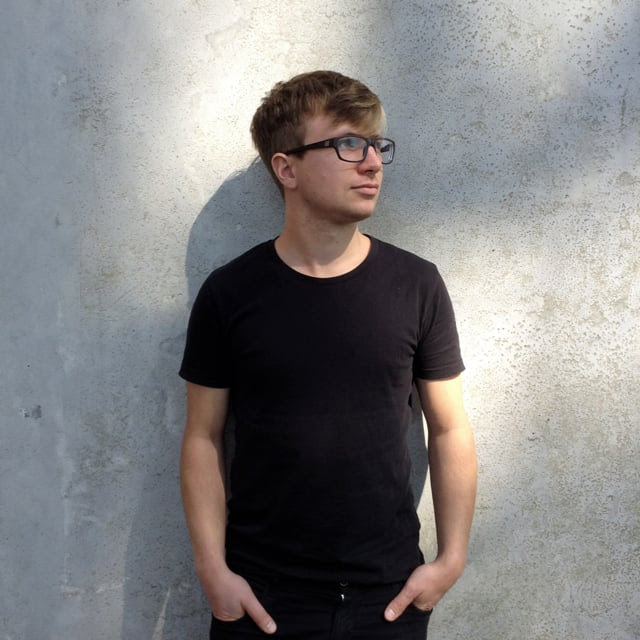
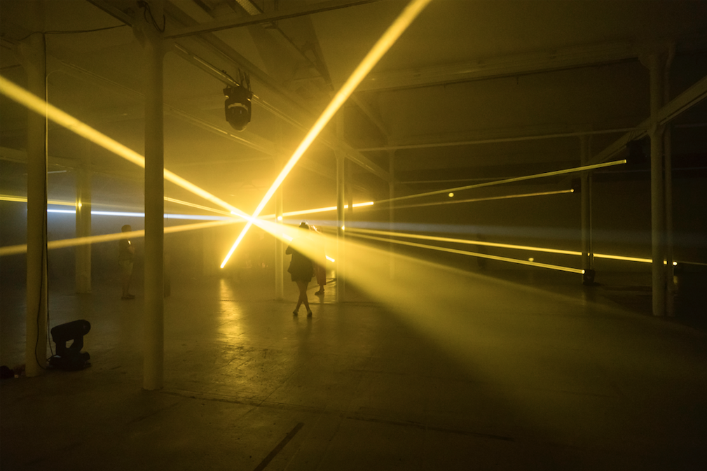

This is edition #5 of Stockpiling Food For Thought - the Sensorium Quarantine Weekly Special, with Lukas Truniger.         

Due to the current crisis we can already see dramatic drop in air or noise pollution. This situation highlights how everything is interconnected on micro and macro scale.  Lukas Truniger is a Swiss media artist and electronic musician, who engages in the areas of multimedia installations, performances and the creation of new musical instruments. His work is often defined by this interconnection of nature and our technological world. He is fascinated by the intangible, the invisible and the complex in nature such as emergence or biological interactions, as well as in society in the form of language, (artificial) intelligence or human infrastructures. 

***

Lukas obtained a music degree from the Institute for music and media (IMM) in Düsseldorf (D) and a post gradual diploma in fine arts from Le Fresnoy – studio national des arts contemporains in Tourcoing (F). At Sensorium he will present his award winning installation **Ethereal Fleeting**. This fascinating machine-like sculpture is slowly generating a continuous series of cloud forms, offering a comparison between a metallic structure and an artificial reproduction of a natural phenomenon. This supposed contrast between technology and nature is explored in a scope of unseen possibilities of sustainable interdependence. The formation of the clouds is programmed to conceal an algorithmic poem, coded into the winds, and the air is used as an ephemeral storage medium.

    
    
    
**Sensorium: Where are you writing from, what is your situation?**
    
    
**Lukas Truniger:** I'm writing from my home in Lille in Northern France – more precisely from my basement, where I set up my temporary studio – because of the government-imposed curfew.

    

 <small><small>_WEthereal Fleeting_ - foto (c) Juan Soria.<small><small>
    
    
**Sensorium: What role can art play in pandemic situations like we are experiencing now? **
    
    
**Lukas Truniger:** There is always a sort of disparity in exercising art in a world which faces immediate and urgent problems. It is important to introspect and reconsider our actions in times like these, as artists as well as citizens.
As an artist I always come to the same conclusion: It is crucial to continue to practice art, to reflect on the things that are happening now, to ask the right questions, put things into perspective and to participate in creating future common grounds through our works.

    

 <small><small>_Latent Realities InSitu3_ foto (c) Lukas Truniger.<small><small>  
    
    
**Sensorium: What has been the most interesting creative reaction to the pandemic that you know of so far?**

**Lukas Truniger:** There are a lot of interesting projects by researchers, makers and hackers which are proposing solutions to problems that our economical system doesn't seem to be able to approach efficiently at the moment. All the proposals for making DIY masks, medical equipment and repairing respiratory devices are really impressive. One of my favorite projects in that extent is the open source and decentralized contact tracing app [DP-3T](https://github.com/DP-3T/). I hope there is a chance that it can be implemented on a large scale, since governments still have big concerns against open source and decentralized technologies.

A lot of people are trying out new things of sharing art virtually as well, especially making use of interactive and multi directional possibilities of digital technologies. So far, I haven't seen something perfectly convincing yet, but I think that very interesting new ways of experiencing art remotely will evolve out of this.
Of course, a virtual experience can't replace the ones in real spaces, with real acoustics and actual presence of performers and artworks. But there will be exciting new disembodied forms of showing and perceiving art among more traditional ones in the future.

    

 <small><small>_dejaEntendu_ inSitu foto (c) Lukas Truniger<small><small>   
    

**Sensorium: Some people say this pandemic will accelerate a wider paradigm shift in society. Do you agree? Can you describe how you see the importance and potential impact of this event on a larger scale?**

**Lukas Truniger:** Personally, I am still shocked to see the situation in Europe and around the globe. The overwhelmed public health systems, the closed borders, the enforcement of control, the lack of global solidarity.
    
    
I see a big danger for a paradigm shift in the wrong direction: national protectionism, forced social (and not physical) distancing, authoritarianism and large scale surveillance, all propagated as viable methods to solve the effects of global problems. We have to find real innovative and courageous solutions to our current situation as well as to the ever looming consequences of climate change.
    
    
For me, it is an important moment to take concrete political stances: for true solidarity in our societies, for a united and strong Europe (with a universal European health care system for example), for more and smart investments in the public sector, for establishing post growth economies, as well as for redistributing wealth and implementing equitable tax systems.

 

    

 <small><small>_Membranes_ - Mex Festival - foto (c) Lukas Truniger<small><small>
    
  
    
**Sensorium: When we look at biomimetics, where natural design elements and processes are used as a model for new materials, devices and tools it is clear that tech is very closely bound to natural phenomena. 
Some people see the emergence of new tech - such as the internet of things as a second nature, or rather not as a separate actor but as an inherent consequence of natural evolution. There is a very particular connection between tech and nature in your work. To me it shows us how technology was actually always part of nature. What do you think about this idea?**

**Lukas Truniger:** This is something that drives me a lot in my work. Biologists are continually discovering that our once considered unique human skills like the use of tools, architecture, farming or medicine (and thus the use of technology), but also other aspects of our culture like communication, grief, intoxication or sexual pleasure aren't exclusive to humans at all. It is truly amazing to see that evolution indeed seems to drive living beings in a sort of "cultural" and "technological" development. The boundaries delimiting the living and the inorganic, the cultural being and the wilderness are becoming more fluid thanks to these advancements in our understanding of nature.
    
    
On the other hand, it is also interesting to notice that we discover all of this with the help of advanced tools like machine learning and data science. We may have not been able to grasp the inherent character of technology within nature without the help of sophisticated technology. Maybe it was necessary that science had to change our point of view from a very anthropocentric one to something a bit broader. Technologies always impose an alteration of perception and change of perspective. There is a big potential of cultural introspection in these tools. Since we are trying to mimic some of our essential competences like the creation of art, innovation and design with computers by the means of artificial intelligence, we are reflecting our own abilities back through these digital entities. Maybe this helps to establish a more inclusive and interconnected concept of ourselves within nature.

**Sensorium: In your work you examine the emergence of all kinds of systems - be it natural or societal. Do you see some interesting unusual patterns emerging now as a direct or indirect consequence of the current crisis? **
 
    
    
**Lukas Truniger:** Since a lot of the systemic effects of our society have been brought down a notch by the pandemic, other aspects can manifest themselves. I think the lack of urban noise and pollution has a big impact of sharpening our senses. Personally, I'm getting much more aware of all the plants and animals living with us in our cities, now that we can hear and see them better.

    
_    
**Thank you very much Lukas for sharing your experience and taking the time to answer our questions.**_
    
    
    
***

Lukas Truniger online:
    
    
[Web](https://lukastruniger.net/)
    
    

[Instagram ](https://www.instagram.com/lukas.truniger/)
    

***

Credits:

Writing: Juraj Hoppan
    
Interviewee: Lukas Truniger
    
Editing: Saša Buricová
    
Publishing: Sensorium Festival
    
Pictures: Courtesy of Lukas Truniger 
    
***
    
[Previous editions - Stockpiling Food For Thought](https://sensorium.is/#food_for_thought)
